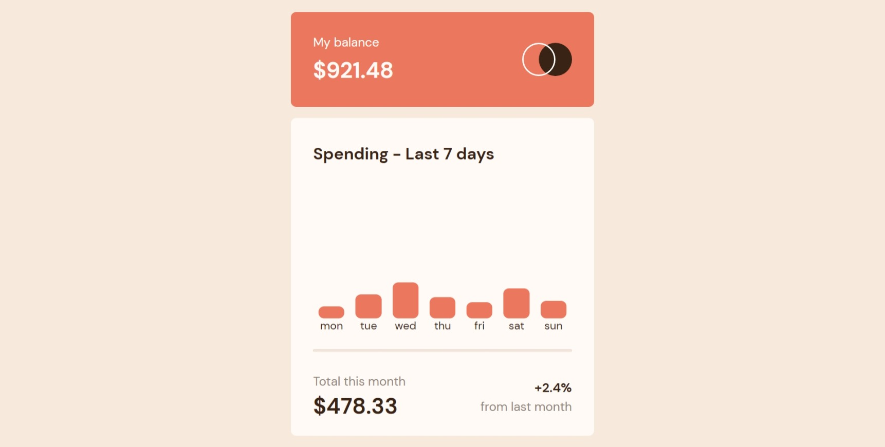
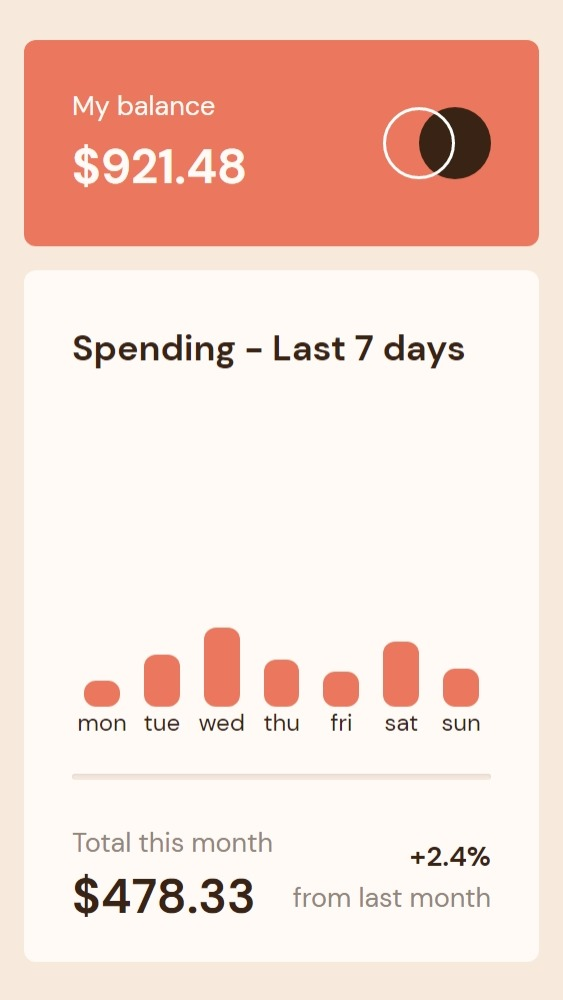
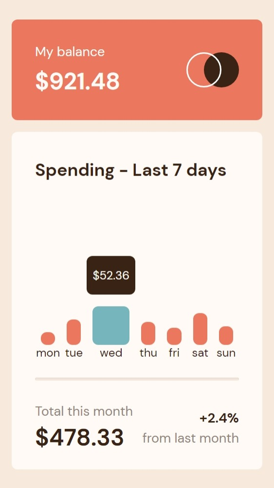

# Frontend Mentor - Expenses chart component solution

This is a solution to the [Expenses chart component challenge on Frontend Mentor](https://www.frontendmentor.io/challenges/expenses-chart-component-e7yJBUdjwt). Frontend Mentor challenges help you improve your coding skills by building realistic projects. 

## Table of contents

- [Overview](#overview)
  - [The challenge](#the-challenge)
  - [Screenshot](#screenshot)
  - [Links](#links)
- [My process](#my-process)
  - [Built with](#built-with)
- [How to use](#how-to-use)
- [Author](#author)

## Overview

### The challenge

Users should be able to:

- [x] View the bar chart and hover over the individual bars to see the correct amounts for each day
- [] See the current day’s bar highlighted in a different colour to the other bars
- [x] View the optimal layout for the content depending on their device’s screen size
- [] See hover states for all interactive elements on the page
- [x] **Bonus**: Use the JSON data file provided to dynamically size the bars on the chart

### Screenshot

#### Desktop


#### Mobile


#### Active


### Links

- Solution URL: [GitHub](https://github.com/im-victor-mendez/expenses_chart_component)
- Live Site URL: [Netlify](https://im-victor-mendez-expenses-chart.netlify.app/)

## My process

### Built with

- Semantic HTML5 markup
- CSS custom properties
- Flexbox
- CSS Grid
- Mobile-first workflow
- [React](https://reactjs.org/) - JS library

## How To Use

### Use

Only visit [demo url](https://im-victor-mendez-expenses-chart.netlify.app/).

### Modify code

To clone and run this application, you'll need [Git](https://git-scm.com) and [Node.js](https://nodejs.org/en/download/) (which comes with [npm](http://npmjs.com)) installed on your computer. From your command line:

```bash
# Clone this repository
git clone https://github.com/im-victor-mendez/random_quote.git

# In terminal locate inside the location where the repository was cloned

# Install dependencies
npm install

# Build app
npm run build

# Run app
npm run preview
```

## Author

- LinkedIn [in/im-victor-mendez](https://www.linkedin.com/in/im-victor-mendez/)
- Frontend Mentor - [@im-victor-mendez](https://www.frontendmentor.io/profile/im-victor-mendez)
- GitHub [@im-victor-mendez](https://github.com/im-victor-mendez)